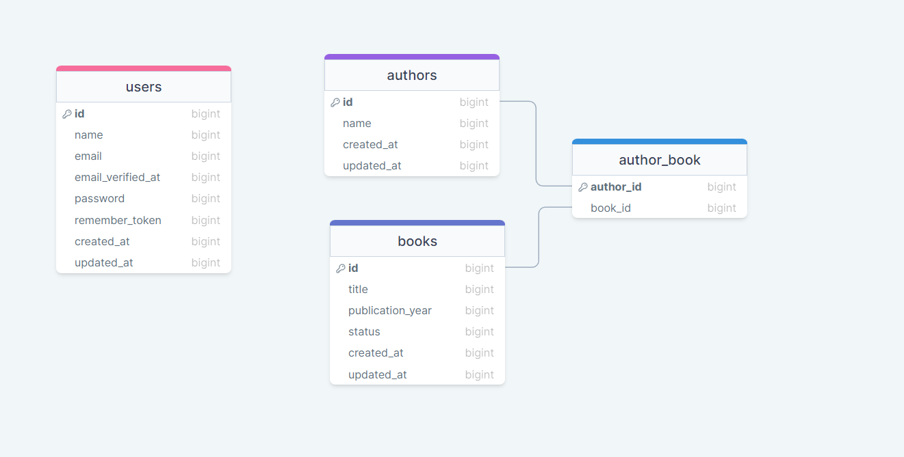

  <h1 style="top: -6px" >Book/Authors Project</h1>


---
 The Book/Authors Project is a web application built with Laravel that allows users to manage a database of books and the authors they are associated with. Users can add, edit, and delete books, as well as add and manage the authors in the database.The application is built with a backend using Laravel and utilizes a MySQL database to store the book and author data.

#
### Table of Contents
* [Prerequisites](#prerequisites)
* [Tech Stack](#tech-stack)
* [Getting Started](#getting-started)
* [Migrations](#migration)
* [Development](#development)
* [Project Structure](#project-structure)

#
### Prerequisites

*  *PHP@7.2 and up*
*  *MYSQL@8 and up*
*  *npm@6 and up*
*  *composer@2 and up*


#
### Tech Stack

*  [Laravel@6.x](https://laravel.com/docs/6.x) - back-end framework

#
### Getting Started
1\. First of all you need to clone E Space repository from github:
```sh
git clone https://github.com/RedberryInternship/dato-papismedovi-movie-quotes.git
```

2\. Next step requires you to run *composer install* in order to install all the dependencies.
```sh
composer install
```

3\. after you have installed all the PHP dependencies, it's time to install all the JS dependencies:
```sh
npm install
```

and also:
```sh
npm run dev
```
in order to build your JS/SaaS resources.

4\. Now we need to set our env file. Go to the root of your project and execute this command.
```sh
cp .env.example .env
```
And now you should provide **.env** file all the necessary environment variables:

#
**MYSQL:**
>DB_CONNECTION=mysql

>DB_HOST=127.0.0.1

>DB_PORT=3306

>DB_DATABASE=*****

>DB_USERNAME=*****

>DB_PASSWORD=*****


after setting up **.env** file, execute:
```sh
php artisan config:cache
```
in order to cache environment variables.

5\. Now execute in the root of you project following:
```sh
  php artisan key:generate
```
Which generates auth key.

6\. Execute in the root of you project following:
```sh
  php artisan storage:link
```
Which creates the symbolic link.

##### Now, you should be good to go!


#
### Migration
if you've completed getting started section, then migrating database if fairly simple process, just execute:
```sh
php artisan migrate
```
#
### Seeding
To get a better understanding of how the application works with data, you can seed your database with some pre-defined data. just execute:
```sh
php artisan migrate:fresh --seed
```
Note that running this command will overwrite any existing data in your database, so make sure you have a backup or do not run it in production environments.

#
### Create User
To gain access to manipulate data in the application, you need to log in with a valid user account. You can create a user account using the following command in your terminal:
```sh
php artisan create:admin
```
Once the user account is created, you can access it by visiting the /login route of the application and using the credentials of the newly created user to log in.


#
### Development

You can run Laravel's built-in development server by executing:

```sh
  php artisan serve
```

when working on JS you may run:

```sh
  npm run dev
```
it builds your js files into executable scripts.


#
### Project Structure

```bash
├─── app
│   ├─── Console
│   ├─── Enums
│   ├─── Exceptions
│   ├─── Http
│   ├─── Models
│   ├─── Providers
├─── bootstrap
├─── config
├─── database
├─── node-modules
├─── public
├─── resources
├─── routes
├─── storage
├─── tests
- .env
- artisan
- composer.json
- package.json
- phpunit.xml
```

Project structure is fairly straitforward(at least for laravel developers)...

For more information about project standards, take a look at these docs:
* [Laravel](https://laravel.com/docs/6.x)

[DrawSQL link](https://drawsql.app/teams/datos-team-2/diagrams/swfit)

